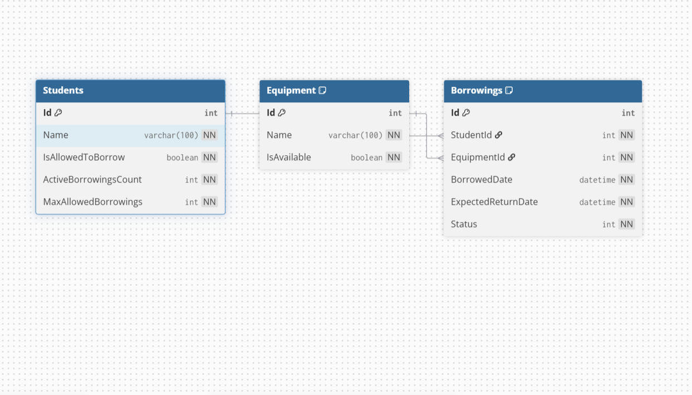

# Campus Equipment Borrowing System

This repository contains a C#/.NET implementation of a Campus Equipment Borrowing System built using Clean Architecture principles. It demonstrates strict separation of concerns, repository pattern abstractions, dependency inversion, domain-driven design, an Avalonia desktop interface, and persistent storage using SQLite with Entity Framework Core.

---

### Members

* Brent Marcus Ocaya
* Darryl Macarandan

## Part A: Requirements & System Analysis

### 1. Actors

* **Student (Primary Actor):** An authorized student who requests to borrow equipment for academic use and expects the system to process their request, validate eligibility, and record active borrowing records.
* **Laboratory Manager / System Administrator:** Responsible for overseeing equipment inventory and relies on the system to enforce borrowing limits, block ineligible students, and track item availability.

---

### 2. Major Use Cases

#### Use Case 1: Borrow Equipment (Implemented)

| Item                 | Description                                                                                                                                                                                                                   |
| -------------------- | ----------------------------------------------------------------------------------------------------------------------------------------------------------------------------------------------------------------------------- |
| **Use Case**         | Borrow Equipment                                                                                                                                                                                                              |
| **Primary Actor**    | Student                                                                                                                                                                                                                       |
| **Preconditions**    | The student is registered in the system, and the equipment exists in the lab catalog.                                                                                                                                         |
| **Main Action**      | The student submits a borrowing request for an available piece of equipment. The system validates student borrowing privileges, borrowing capacity limits, and equipment availability, then records the checkout transaction. |
| **Expected Result**  | A new `Borrowing` record is created with `Active` status, the equipment `IsAvailable` state becomes `false`, and the student's `ActiveBorrowingsCount` increases by 1.                                                        |
| **Possible Failure** | Student is blocked (`IsAllowedToBorrow == false`), student reached borrowing limit (`ActiveBorrowingsCount >= MaxAllowedBorrowings`), or equipment is currently unavailable.                                                  |

#### Use Case 2: Return Equipment

| Item                 | Description                                                                                                                                         |
| -------------------- | --------------------------------------------------------------------------------------------------------------------------------------------------- |
| **Use Case**         | Return Equipment                                                                                                                                    |
| **Primary Actor**    | Student                                                                                                                                             |
| **Preconditions**    | An active borrowing transaction exists for the student and equipment item.                                                                          |
| **Main Action**      | The student returns the borrowed equipment to the laboratory. The system marks the borrowing record as returned and updates the item availability.  |
| **Expected Result**  | Borrowing status changes to `Returned`, the equipment `IsAvailable` state becomes `true`, and the student's `ActiveBorrowingsCount` decreases by 1. |
| **Possible Failure** | No active borrowing record is found matching the provided student and equipment IDs.                                                                |

#### Use Case 3: Find Available Equipment

| Item                 | Description                                                                                                                                            |
| -------------------- | ------------------------------------------------------------------------------------------------------------------------------------------------------ |
| **Use Case**         | Find Available Equipment                                                                                                                               |
| **Primary Actor**    | Student / Laboratory Manager                                                                                                                           |
| **Preconditions**    | Equipment records exist in the repository catalog.                                                                                                     |
| **Main Action**      | The actor requests a list of all equipment currently available for checkout. The system queries storage and filters items where `IsAvailable == true`. |
| **Expected Result**  | A list of available equipment items is returned and displayed to the actor.                                                                            |
| **Possible Failure** | No equipment items match the search query, or all equipment items are currently checked out.                                                           |

---

### 3. Domain Concepts

* **Student**

  * **Information:** `Id`, `Name`, `IsAllowedToBorrow`, `ActiveBorrowingsCount`, `MaxAllowedBorrowings`.
  * **Rules/State:** Tracks whether the student is eligible to borrow and if they have reached their maximum allowed active borrowings.
  * **Non-Responsibilities:** Does not track equipment inventory or save student data to a database.

* **Equipment**

  * **Information:** `Id`, `Name`, `IsAvailable`.
  * **Rules/State:** Tracks whether the physical equipment item is currently free to be borrowed.
  * **Non-Responsibilities:** Does not track who borrowed the item or calculate due dates.

* **Borrowing**

  * **Information:** `Id`, `StudentId`, `EquipmentId`, `BorrowedDate`, `ExpectedReturnDate`, `Status`.
  * **Rules/State:** Represents an active or completed transaction connecting a student to an item with an expected return timeline.
  * **Non-Responsibilities:** Does not directly modify database tables or handle user input formatting.

---

## Part I: Architecture Explanation

### 1. Solution Structure

* **`EquipmentBorrowing.Domain` (Class Library):** Holds the core enterprise logic, entity models (`Student`, `Equipment`, `Borrowing`), and domain enums (`BorrowingStatus`). It has **zero dependencies** on external libraries or other projects.
* **`EquipmentBorrowing.Application` (Class Library):** Contains application use cases (`BorrowEquipmentService`, `ReturnEquipmentService`), result DTOs (`BorrowResult`, `ReturnResult`), and repository interfaces (`IStudentRepository`, `IEquipmentRepository`, `IBorrowingRepository`). It coordinates domain models and defines required data access contracts.
* **`EquipmentBorrowing.Infrastructure` (Class Library):** Implements technical mechanisms and persistence defined by the Application layer. It contains the Entity Framework Core `DbContext`, entity configurations, SQLite persistence, EF Core repositories, database migrations, and the original in-memory repositories retained as alternative implementations.
* **`EquipmentBorrowing.ConsoleApp` (Console Application):** The executable entry point (`Program.cs`). It assembles dependencies via manual Dependency Injection and can execute application service demonstration scenarios.
* **`EquipmentBorrowing.Tests` (xUnit Project):** Contains automated tests verifying domain entity constraints and application service validation logic.
* **`EquipmentBorrowing.Desktop` (Avalonia Application):** Provides the graphical user interface using Avalonia and the MVVM pattern. It consumes the Application and Infrastructure layers through dependency injection.

---

### 2. Architecture Reflection

Question 1: How does Clean Architecture enforce the Dependency Inversion Principle here?

* High-level policy classes like `BorrowEquipmentService` inside the Application layer do not depend on low-level data access implementations. Instead, they depend on interface abstractions (`IStudentRepository`, `IEquipmentRepository`, `IBorrowingRepository`) defined in the Application layer itself. The concrete implementations reside in the Infrastructure layer and are injected at runtime.

Question 2: What are the benefits of decoupling domain models from storage mechanisms?

* Decoupling domain logic from persistence ensures that business rules remain completely agnostic to storage technologies. The repository implementation can be replaced with Entity Framework Core, SQL Server, or another persistence mechanism without modifying the core business logic.

Question 3: Why are validation checks placed in the Application Service rather than the ConsoleApp?

* Placing validation logic inside `BorrowEquipmentService` centralizes business rule enforcement. If the application expands to support a Web API, Desktop UI, or Mobile frontend in the future, the same validation rules can be reused without duplicating code across user interfaces.

Question 4: How do asynchronous interfaces (`Task<T>`) prepare the application for real-world persistence?

* Real-world databases and network operations require non-blocking I/O operations. Defining repository methods as asynchronous (`Task<T>`) ensures the Application layer is compatible with asynchronous database operations such as those provided by EF Core.

Question 5: What role do mock/in-memory repositories play during software development?

* In-memory repositories allow developers to build, test, and validate core application workflows and domain rules without requiring an external database. They also provide fast implementations that can be useful for testing and demonstrations.

---

## Part L: Desktop Application (Activity 2)

### 1. Desktop Project

`EquipmentBorrowing.Desktop` is an Avalonia UI desktop application that adds a graphical presentation layer on top of the architecture from Activity 1. It follows the Model-View-ViewModel (MVVM) pattern using **CommunityToolkit.Mvvm** for observable properties and commands.

The project references only `EquipmentBorrowing.Application` and `EquipmentBorrowing.Infrastructure` directly. Neither `EquipmentBorrowing.Domain` nor `EquipmentBorrowing.Application` reference Avalonia in any way — the UI is layered strictly on top of the existing architecture, not merged into it.

Dependency injection is configured via **Microsoft.Extensions.DependencyInjection**, wired in `App.axaml.cs`. The application now registers Entity Framework Core repositories and a SQLite `DbContext` for persistent storage. Application services and ViewModels remain separate from the persistence implementation.

### 2. Updated Architecture

```text
Avalonia View (EquipmentView, BorrowingsView)
│
│ Binding / Command
▼
ViewModel (EquipmentViewModel, BorrowingsViewModel)
│
│ Application Operation
▼
Application Service
(BorrowEquipmentService, ReturnEquipmentService)
│
├──────────► Domain
│            (Student, Equipment, Borrowing)
│
▼
Repository Interface
(IStudentRepository, IEquipmentRepository, IBorrowingRepository)
▲
│
Infrastructure Implementation
(EfStudentRepository,
 EfEquipmentRepository,
 EfBorrowingRepository)
│
▼
EquipmentBorrowingDbContext
│
▼
SQLite Database
```

All wiring between layers is assembled once, at startup, inside `App.axaml.cs`'s `ConfigureServices` method — the composition root for the Desktop application.

### 3. Borrow Equipment Flow

1. The user selects an equipment item from the list in `EquipmentView` (bound to `SelectedEquipment`), enters a Student ID, and picks an expected return date.
2. Clicking **Borrow Equipment** triggers `BorrowCommand`, generated automatically by `[RelayCommand]` on `EquipmentViewModel.BorrowAsync()`.
3. The ViewModel first performs **presentation validation only**: is an equipment item selected, is the Student ID a valid number, and is the return date today or later. These are input-format checks, not business rules.
4. If presentation validation passes, the ViewModel calls `_borrowEquipmentService.ExecuteAsync(studentId, equipmentId, expectedReturnDate)`.
5. `BorrowEquipmentService` performs all actual **business validation** (student allowed to borrow, borrowing limit not exceeded, equipment available) using the injected repositories, then creates and persists a new `Borrowing` record if every check passes.
6. The service returns a `BorrowResult` indicating success or failure with a message.
7. The ViewModel updates `StatusMessage` with the result and, on success, reloads the equipment list so the UI reflects the item's new `IsAvailable` state.

### 4. Return Equipment Flow

1. The user switches to the Active Borrowings screen, which loads all borrowings with `Status == Active` via `IBorrowingRepository.GetActiveBorrowingsAsync()`.
2. Selecting a borrowing binds it to `BorrowingsViewModel.SelectedBorrowing`.
3. Clicking **Return Equipment** triggers `ReturnCommand`, calling `ReturnEquipmentService.ExecuteAsync(borrowingId)`.
4. The service locates the borrowing, confirms it has not already been returned, marks its status as `Returned`, sets the related equipment's `IsAvailable` back to `true`, and decrements the student's `ActiveBorrowingsCount` — coordinating all three repositories within one service method.
5. A `ReturnResult` is returned to the ViewModel, which updates `StatusMessage` and reloads the active borrowings list, removing the now-returned item from the visible collection.

### 5. Architectural Reflection

**1. Why should the View not call a repository directly?**

The View is only responsible for layout, controls, and bindings — it has no knowledge of business rules or data access. Letting it call a repository directly would scatter business logic across the UI layer and break the separation Activity 1 was built around, making the same rules impossible to reuse if a different UI were added later.

**2. Why should business rules not be implemented in the ViewModel?**

The ViewModel's job is to manage presentation state and translate user actions into calls to the Application layer — not to decide whether an operation is allowed. If borrowing rules were duplicated inside `EquipmentViewModel`, they could drift out of sync with the rules already correctly implemented in `BorrowEquipmentService`, creating two sources of truth for the same business decision.

**3. What is the responsibility of the ViewModel?**

To hold presentation state such as selected items, input values, and status messages; expose commands the View can bind to; perform lightweight presentation validation; delegate real business operations to the appropriate Application service; and reflect the resulting state in the UI.

**4. Why can the existing Application layer work without knowing that Avalonia is being used?**

`BorrowEquipmentService` and `ReturnEquipmentService` depend only on repository interfaces and domain types defined in `EquipmentBorrowing.Application` and `EquipmentBorrowing.Domain`. Neither project references Avalonia. The Desktop project depends on Application, not the other way around, so the same services could be reused by a console app, Web API, mobile frontend, or another presentation layer.

**5. What advantage is gained from registering dependencies in one composition point?**

All object construction and wiring happens in a single place (`App.axaml.cs`'s `ConfigureServices`) instead of being scattered throughout the application. Changing an implementation or adding a dependency can therefore be handled through the application's dependency registration.

**6. If the in-memory repository were replaced by SQLite later, which parts of the current interface should remain largely unchanged?**

The repository interfaces, domain models, application services, ViewModels, and Views would remain largely unchanged. Only the Infrastructure layer's concrete repository implementations and database configuration would need to change.

---

# Part II: Persistent Storage with SQLite and Entity Framework Core (Activity 3)

## 1. Database Design

Activity 3 extends the existing Campus Equipment Borrowing System by replacing the primary in-memory storage implementation with persistent SQLite storage.

The database contains three main tables:

* **Students** — stores student borrowing eligibility and borrowing limits.
* **Equipment** — stores the equipment catalog and current availability.
* **Borrowings** — records borrowing transactions and connects students with equipment.

The relationships are:

* One Student can have many Borrowings.
* One Equipment item can appear in many Borrowings over time.
* Each Borrowing belongs to one Student and one Equipment item.



### Relational Schema

#### Students

| Column                  | Type    | Constraints                      |
| ----------------------- | ------- | -------------------------------- |
| `Id`                    | Integer | Primary Key                      |
| `Name`                  | String  | Required, maximum 100 characters |
| `IsAllowedToBorrow`     | Boolean | Required                         |
| `ActiveBorrowingsCount` | Integer | Required                         |
| `MaxAllowedBorrowings`  | Integer | Required                         |

#### Equipment

| Column        | Type    | Constraints                      |
| ------------- | ------- | -------------------------------- |
| `Id`          | Integer | Primary Key                      |
| `Name`        | String  | Required, maximum 100 characters |
| `IsAvailable` | Boolean | Required                         |

An index is created on `Equipment.Name` to support equipment lookup and ordering.

#### Borrowings

| Column               | Type     | Constraints           |
| -------------------- | -------- | --------------------- |
| `Id`                 | Integer  | Primary Key           |
| `StudentId`          | Integer  | Required, Foreign Key |
| `EquipmentId`        | Integer  | Required, Foreign Key |
| `BorrowedDate`       | DateTime | Required              |
| `ExpectedReturnDate` | DateTime | Required              |
| `Status`             | Integer  | Required              |

Indexes are created on `StudentId`, `EquipmentId`, and `Status`.

Foreign keys connect `Borrowings.StudentId` to `Students.Id` and `Borrowings.EquipmentId` to `Equipment.Id`. Restrict delete behavior is used so that existing borrowing records cannot be invalidated by deleting their related student or equipment records.

---

## 2. SQLite and Entity Framework Core

SQLite is used as the persistent database provider for the application.

The Infrastructure project uses:

* `Microsoft.EntityFrameworkCore`
* `Microsoft.EntityFrameworkCore.Sqlite`
* `Microsoft.EntityFrameworkCore.Design`

The database file is stored at:

```text
Data/equipment-borrowing.db
```

The database file is generated locally and is not committed to Git. EF Core migrations are committed instead so that the database structure can be recreated.

The Desktop application configures SQLite through dependency injection:

```csharp
var connectionString = "Data Source=Data/equipment-borrowing.db";

services.AddDbContext<EquipmentBorrowingDbContext>(options =>
    options.UseSqlite(connectionString));
```

The application does not reset or recreate the database every time it starts. Existing records therefore remain available between application sessions.

---

## 3. DbContext

`EquipmentBorrowingDbContext` is responsible for representing the application's database through Entity Framework Core.

It exposes:

```csharp
public DbSet<Student> Students => Set<Student>();
public DbSet<Equipment> Equipment => Set<Equipment>();
public DbSet<Borrowing> Borrowings => Set<Borrowing>();
```

Entity-specific database rules are separated into configuration classes:

* `StudentConfiguration`
* `EquipmentConfiguration`
* `BorrowingConfiguration`

The DbContext applies these configurations through:

```csharp
modelBuilder.ApplyConfigurationsFromAssembly(
    typeof(EquipmentBorrowingDbContext).Assembly);
```

This keeps database mapping concerns out of the domain entities.

---

## 4. Entity Relationships and Constraints

The database uses foreign keys to represent the relationships between borrowing records and their related entities.

```text
Students
   │
   │ 1
   │
   │ *
Borrowings
   │
   │ *
   │
   │ 1
Equipment
```

A `Borrowing` requires both a valid `StudentId` and a valid `EquipmentId`.

The following constraints are configured:

* Primary keys for all three tables.
* Required student and equipment names.
* Maximum length of 100 characters for names.
* Required boolean, integer, and date fields.
* Foreign keys from `Borrowings` to `Students` and `Equipment`.
* Indexes on equipment name.
* Indexes on borrowing student, equipment, and status.
* Restrict delete behavior for referenced Student and Equipment records.

These constraints help maintain data integrity at the database level.

---

## 5. Database Migrations

EF Core migrations are used to version and apply database schema changes.

The project currently contains:

```text
Migrations/
├── 20261004050129_InitialCreate.cs
├── 20261004050129_InitialCreate.Designer.cs
├── 20261004050648_SeedInitialData.cs
├── 20261004050648_SeedInitialData.Designer.cs
└── EquipmentBorrowingDbContextModelSnapshot.cs
```

The first migration creates the relational database structure.

The second migration adds the initial seed data.

The database was then updated using EF Core so that the SQLite database matches the migration history.

Seed data is defined using EF Core's `HasData()` configuration.

Initial students include:

* Juan Dela Cruz
* Maria Santos
* Pedro Reyes

Initial equipment includes:

* Laptop
* Projector
* Camera
* Microphone

No borrowing records are seeded because borrowing records should represent actual transactions performed through the application.

---

## 6. Repository Transition

The Application layer continues to depend only on repository interfaces:

```text
IStudentRepository
IEquipmentRepository
IBorrowingRepository
```

The Infrastructure layer now provides Entity Framework Core implementations:

```text
EfStudentRepository
EfEquipmentRepository
EfBorrowingRepository
```

The original in-memory repositories remain in the Infrastructure project as alternative implementations, but the Desktop application now registers the EF Core repositories.

The application services and ViewModels do not directly depend on `EquipmentBorrowingDbContext`.

The resulting architecture is:

```text
View
↓
ViewModel
↓
Application Service
↓
Repository Interface
↓
EF Core Repository
↓
DbContext
↓
SQLite
```

This allows the persistence implementation to change without changing the business logic or presentation layers.

---

## 7. LINQ Database Queries

The EF Core repositories contain database queries implemented with LINQ.

### Query 1: Available Equipment

```csharp
return await _dbContext.Equipment
    .AsNoTracking()
    .Where(e => e.IsAvailable)
    .OrderBy(e => e.Name)
    .ToListAsync(cancellationToken);
```

This query filters equipment to only records where `IsAvailable` is true and orders the results by name.

The query is executed by the database through EF Core rather than loading every equipment record into application memory first.

### Query 2: Active Borrowings with Student and Equipment Details

```csharp
return await (
    from borrowing in _dbContext.Borrowings.AsNoTracking()
    join student in _dbContext.Students
        on borrowing.StudentId equals student.Id
    join equipment in _dbContext.Equipment
        on borrowing.EquipmentId equals equipment.Id
    where borrowing.Status == BorrowingStatus.Active
    orderby borrowing.BorrowedDate descending
    select new ActiveBorrowingDetails(
        borrowing.Id,
        student.Name,
        equipment.Name,
        borrowing.BorrowedDate,
        borrowing.ExpectedReturnDate)
).ToListAsync(cancellationToken);
```

This query demonstrates a relational join between Borrowings, Students, and Equipment while returning only active transactions.

### Query 3: Overdue Borrowings

The repository also contains a query for identifying overdue active borrowings:

```csharp
var now = DateTime.UtcNow;

return await _dbContext.Borrowings
    .AsNoTracking()
    .Where(b =>
        b.Status == BorrowingStatus.Active &&
        b.ExpectedReturnDate < now)
    .OrderBy(b => b.ExpectedReturnDate)
    .ToListAsync(cancellationToken);
```

This query filters active borrowing records whose expected return date has already passed.

---

## 8. Generated SQL Inspection

The SQL generated by EF Core was inspected during development.

For the available equipment LINQ query, EF Core generated:

```sql
SELECT "e"."Id", "e"."IsAvailable", "e"."Name"
FROM "Equipment" AS "e"
WHERE "e"."IsAvailable"
ORDER BY "e"."Name"
```

For the active borrowing join, EF Core generated:

```sql
SELECT "b"."Id", "s"."Name", "e"."Name", "b"."BorrowedDate", "b"."ExpectedReturnDate"
FROM "Borrowings" AS "b"
INNER JOIN "Students" AS "s" ON "b"."StudentId" = "s"."Id"
INNER JOIN "Equipment" AS "e" ON "b"."EquipmentId" = "e"."Id"
WHERE "b"."Status" = 0
ORDER BY "b"."BorrowedDate" DESC
```

The SQL demonstrates that the LINQ expressions are translated into relational SQL executed by SQLite rather than filtering the complete database in application memory.

The required SQL examples are also documented in:

```text
docs/database-queries.sql
```

The SQL file contains examples for:

1. Basic retrieval
2. Filtering
3. Joining related tables
4. Aggregation
5. Updating a record

---

## 9. Tracking and `AsNoTracking()`

The repositories use `AsNoTracking()` for display-only and read-only queries.

Examples include:

* retrieving all equipment;
* retrieving available equipment;
* retrieving students;
* retrieving individual records for validation;
* retrieving active borrowing records;
* retrieving joined borrowing details;
* retrieving overdue borrowing records.

These entities do not need to be tracked because they are being read for display or validation.

For modifications, the repository explicitly attaches the entity using methods such as:

```csharp
_dbContext.Equipment.Update(equipment);
```

or:

```csharp
_dbContext.Borrowings.Update(borrowing);
```

followed by:

```csharp
await _dbContext.SaveChangesAsync(cancellationToken);
```

This separates read-only queries from operations where changes must be persisted.

---

## 10. Persistence Demonstration

Persistence was verified using the actual desktop application.

The workflow was:

1. Borrow a Laptop for Juan Dela Cruz.
2. Close the desktop application.
3. Reopen the application.
4. Confirm that the active borrowing still exists.
5. Return the Laptop.
6. Close the application again.
7. Reopen the application.
8. Confirm that the borrowing has a `Returned` status and the equipment is available again.

This demonstrates that borrowing and return state are stored in SQLite rather than existing only in application memory.

---

## 11. Database Query Documentation

The required SQL examples are stored separately in:

```text
docs/database-queries.sql
```

The file contains the following required query types:

### Basic Retrieval

Retrieves all equipment:

```sql
SELECT *
FROM Equipment;
```

### Filtering

Retrieves only currently available equipment:

```sql
SELECT *
FROM Equipment
WHERE IsAvailable = 1
ORDER BY Name;
```

### Join

Retrieves active borrowings together with the corresponding student and equipment:

```sql
SELECT
    s.Name AS Student,
    e.Name AS Equipment,
    b.BorrowedDate AS Borrowed,
    b.ExpectedReturnDate AS Due
FROM Borrowings AS b
INNER JOIN Students AS s
    ON b.StudentId = s.Id
INNER JOIN Equipment AS e
    ON b.EquipmentId = e.Id
WHERE b.Status = 0
ORDER BY b.BorrowedDate DESC;
```

### Aggregate

Counts active borrowings for each student:

```sql
SELECT
    s.Name AS Student,
    COUNT(b.Id) AS ActiveBorrowings
FROM Students AS s
LEFT JOIN Borrowings AS b
    ON s.Id = b.StudentId
    AND b.Status = 0
GROUP BY s.Id, s.Name
ORDER BY ActiveBorrowings DESC;
```

### Update

Updates equipment availability:

```sql
UPDATE Equipment
SET IsAvailable = 1
WHERE Id = 1;
```

These queries demonstrate basic retrieval, filtering, relational joins, aggregation, and modification.

---

## 12. Architectural Reflection

### Question 1: Why was the application not completely rewritten with SQLite?

The application was not rewritten because the existing architecture already separated business logic from data access through repository interfaces. SQLite only required new Infrastructure implementations of those interfaces. Keeping the existing Application and Domain layers avoids duplicating or rewriting business rules.

### Question 2: Why should the ViewModel not use `DbContext` directly?

The ViewModel belongs to the presentation layer and should not know how data is stored. Directly using `DbContext` would couple the UI to Entity Framework Core and bypass the Application layer and repository abstractions. This would make the architecture harder to test and harder to change.

### Question 3: What is the responsibility of the repository?

The repository is responsible for providing the Application layer with the data-access operations it needs without exposing persistence implementation details. The EF Core repositories translate those operations into database queries and persist changes through the `DbContext`.

### Question 4: What is the purpose of an EF Core migration?

A migration records changes to the database schema in a versioned and repeatable way. It allows the database structure to be created or updated consistently without manually recreating the tables.

### Question 5: Why are foreign keys important?

Foreign keys enforce relationships between related tables. In this system, they ensure that a Borrowing references an existing Student and Equipment record. This protects referential integrity and prevents invalid relationships from being stored.

### Question 6: Why is `AsNoTracking()` useful?

`AsNoTracking()` is useful for read-only queries because EF Core does not need to keep track of the returned entities for later updates. This reduces unnecessary change-tracking overhead and clearly communicates that the retrieved data is intended for display or inspection.

### Question 7: What would happen if SQLite were replaced with another database provider?

The Domain models, Application services, repository interfaces, ViewModels, and Views could remain largely unchanged. The Infrastructure configuration and repository implementation could be adapted to another EF Core provider, such as SQL Server or PostgreSQL. This demonstrates the benefit of keeping persistence concerns behind repository abstractions.

---

## 13. Final Architecture

The completed system follows the architecture below:

```text
┌──────────────────────────────────────┐
│          Avalonia Desktop UI         │
│        Views + ViewModels            │
└──────────────────┬───────────────────┘
                   │
                   ▼
┌──────────────────────────────────────┐
│          Application Layer           │
│  BorrowEquipmentService               │
│  ReturnEquipmentService              │
│  Repository Interfaces               │
└──────────────────┬───────────────────┘
                   │
                   ▼
┌──────────────────────────────────────┐
│             Domain Layer             │
│ Student • Equipment • Borrowing      │
└──────────────────────────────────────┘
                   ▲
                   │
┌──────────────────────────────────────┐
│        Infrastructure Layer          │
│ EF Repositories + DbContext          │
│ Entity Configurations + Migrations   │
└──────────────────┬───────────────────┘
                   │
                   ▼
┌──────────────────────────────────────┐
│           SQLite Database            │
│ Students • Equipment • Borrowings    │
└──────────────────────────────────────┘
```

The architecture preserves the separation established in the earlier activities while adding persistent relational storage.

The final data-access flow is:

```text
Avalonia View
      ↓
ViewModel
      ↓
Application Service
      ↓
Repository Interface
      ↓
EF Core Repository
      ↓
DbContext
      ↓
SQLite
```

This design allows the application to maintain its existing business rules and UI while replacing temporary in-memory state with persistent relational storage.
